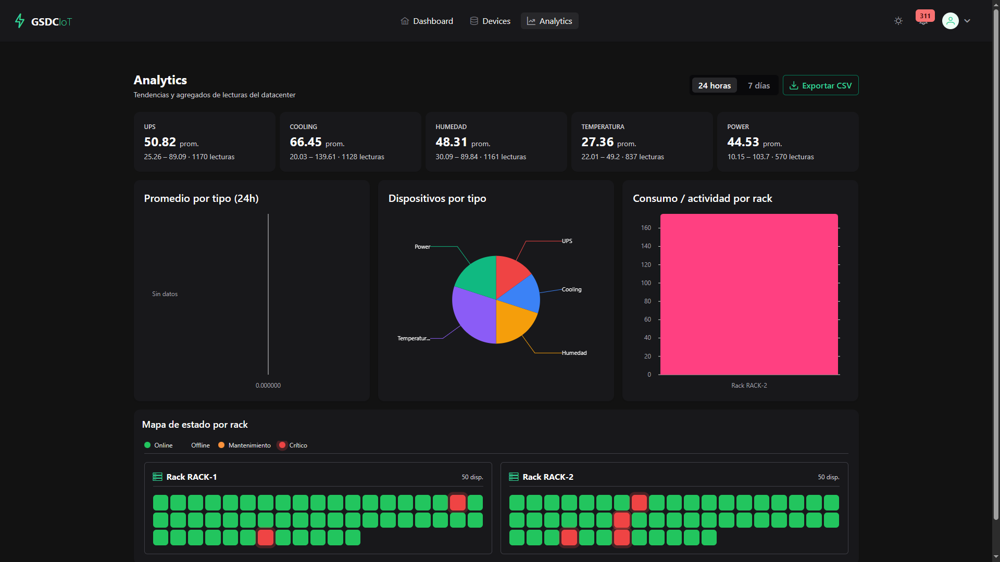
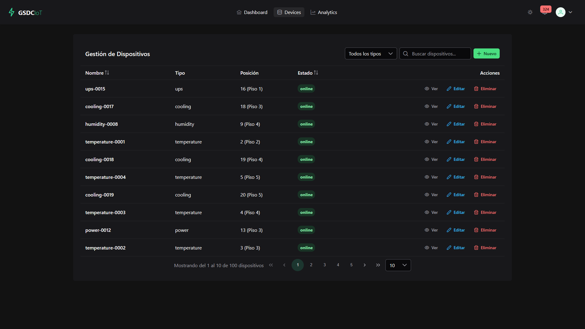
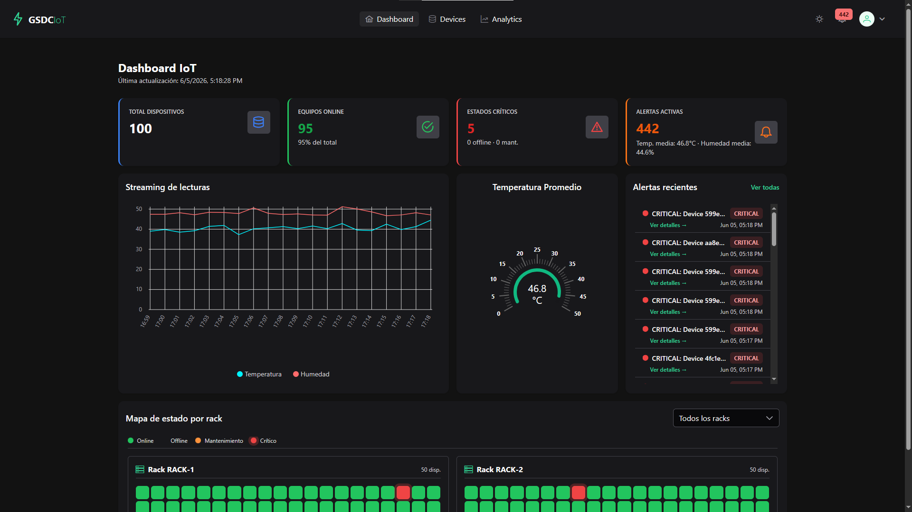
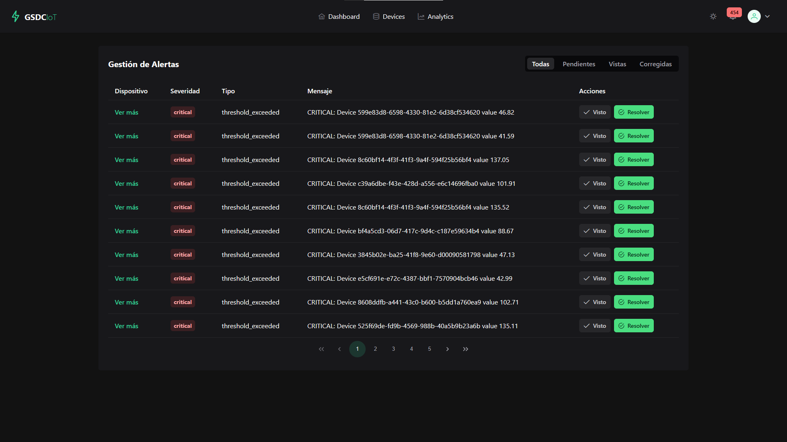

# GSDC IoT Monitor — Frontend

Dashboard de monitoreo IoT en tiempo real construido con Angular 21 + PrimeNG.

## Arquitectura


## Capturas de Pantalla

| Dashboard | Dispositivos | Detalle |
|-----------|-------------|---------|
|  |  | 

| Alertas | Analytics |
|---------|-----------|
|  |  |

## Estructura del Proyecto

```
Frontend/src/app/
├── core/           # Servicios, modelos, guards, interceptors
│   ├── models/     # Interfaces del dominio (Device, Alert, Reading)
│   ├── directives/ # Directivas personalizadas (hasRole)
│   ├── pipes/      # Pipes personalizados
│   ├── auth.ts     # AuthService (login, logout, token storage)
│   ├── device.ts   # DeviceService (CRUD + paginación)
│   ├── iot.service.ts  # WebSocket + HTTP inicial
│   ├── theme.service.ts # Tema oscuro/claro con localStorage
│   └── dashboard.service.ts # Dashboard KPIs
├── features/       # Módulos de funcionalidad (lazy loaded)
│   ├── auth/       # Login
│   ├── dashboard/  # Overview, KPIs, gráficas, rack heatmap
│   ├── devices/    # CRUD, detalle con streaming, formulario
│   ├── alerts/     # Lista filtrable de alertas
│   └── main-layout/# Nav, menú, theme toggle
└── state/          # DashboardStore (NgRx Signals)
```

## Stack

| Capa               | Tecnología                                    |
|-------------------|-----------------------------------------------|
| Framework         | Angular 21                                    |
| UI Library        | PrimeNG 21 + PrimeIcons + PrimeFlex            |
| Gráficas          | @swimlane/ngx-charts (5 tipos)                 |
| State Management  | @ngrx/signals                                  |
| WebSocket Client  | socket.io-client                               |
| HTTP Proxy        | proxy.conf.json (dev → localhost:3000)         |
| TypeScript        | 5.9, strict mode, sin `any`                   |
| Change Detection  | OnPush en todos los componentes                |

## Pantallas

| Pantalla            | Ruta           | Funcionalidades                               |
|--------------------|----------------|-----------------------------------------------|
| Login              | `/login`       | Formulario reactivo, manejo de errores        |
| Dashboard          | `/dashboard`   | KPIs, gráfica streaming, gauge temperatura, rack heatmap, feed alertas |
| Dispositivos       | `/devices`     | CRUD, tabla filtrável, búsqueda debounce, paginación cursor-based |
| Detalle Dispositivo| `/devices/:id` | Gráfica streaming en vivo, historial agrupado, estadísticas, alertas |
| Alertas            | `/alerts`      | Lista filtrable (todas/pendientes/vistas/corregidas), reconocer/resolver |
| Analytics          | `/analytics`   | Tendencias por tipo, heatmap por rack, exportar CSV |

## Prerrequisitos

- Node.js 20+
- npm 10+
- Backend corriendo en `http://localhost:3000`

## Inicio Rápido

### 1. Instalar dependencias

```bash
cd Frontend
npm install
```

### 2. Iniciar servidor de desarrollo

```bash
npm start
```

Frontend en `http://localhost:4200`. Las peticiones `/api/*` y `/socket.io/*` se redirigen al backend via proxy.

### 3. Login

Credenciales por defecto:

| Rol    | Email               | Password     |
|--------|---------------------|--------------|
| Admin  | admin@iot.local     | Admin123!    |

## Build para Producción

```bash
npm run build
```

El build se genera en `dist/frontend/browser/`. Servir con cualquier servidor estático (Nginx, S3 + CloudFront, etc.).

### Ejemplo con Nginx

```nginx
server {
    listen 80;
    root /var/www/iot-monitor;
    index index.html;
    try_files $uri $uri/ /index.html;
}
```

## Proxy de Desarrollo

`proxy.conf.json` redirige al backend:

```json
{
  "/api": { "target": "http://localhost:3000" },
  "/socket.io": { "target": "http://localhost:3000", "ws": true }
}
```

Para cambiar el backend en producción, configurar en el servidor Angular o usar variables de entorno al build.

## Variables de Entorno

El frontend no usa `.env`. La URL del backend se configura via:

- **Desarrollo**: `proxy.conf.json`
- **Producción**: servidor web (Nginx reverse proxy) o build-time con `--base-href`

## Features Técnicas

### Estado Global (NgRx Signals)

`DashboardStore` gestiona:

- Lista de dispositivos + total de registros
- Alertas en memoria
- Series de gráficas por dispositivo (streaming)
- Series agregadas (temperatura promedio, humedad promedio)
- Estado de carga

### Tiempo Real (WebSocket)

`IoTService` se conecta vía Socket.IO y maneja:

| Evento              | Acción                               |
|--------------------|--------------------------------------|
| `device:reading`   | Actualiza valor + gráfica streaming  |
| `device:status`    | Cambia estado en tabla y store       |
| `alert:new`        | Agrega alerta + notificación sonora  |
| `alert:resolved`   | Actualiza alerta existente           |

### Paginación Cursor-Based

Tanto dispositivos como alertas usan cursor-based pagination con `LastEvaluatedKey` de DynamoDB, codificado en base64. El frontend mantiene un array de cursores por página.

### Seguridad

- `AuthInterceptor`: adjunta JWT a todas las peticiones HTTP
- `AuthGuard`: protege rutas, redirige a login si no hay sesión
- `hasRole` directive: muestra/oculta elementos según rol del usuario
- Rate limiting: el frontend muestra mensaje cuando el backend responde 429

### Tema Oscuro/Claro

`ThemeService` persiste la preferencia en `localStorage`. Usa variables CSS de PrimeNG Aura (`--p-*`), aplicando la clase `p-dark` al `<html>`.

### Gráficas (ngx-charts)

| Tipo                | Uso                                    |
|--------------------|----------------------------------------|
| Line Chart         | Streaming de lecturas en vivo          |
| Gauge              | Temperatura actual + umbrales          |
| Bar (vertical)     | Potencia por rack                      |
| Bar (horizontal)   | Analytics agrupados por tipo           |
| Pie                | Distribución de dispositivos por estado|
| Heatmap            | Temperatura por rack/posición          |
