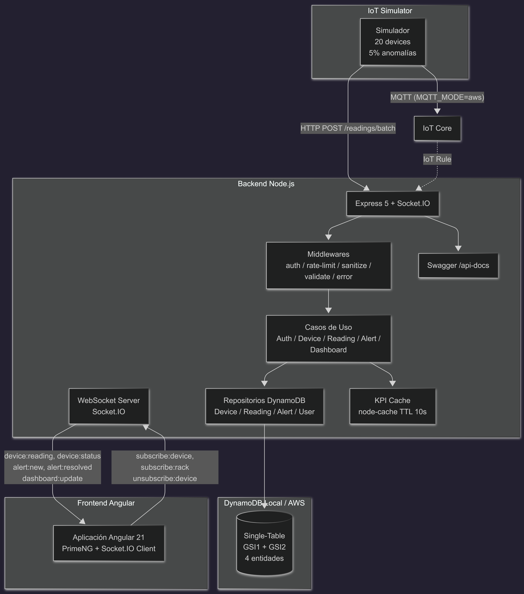
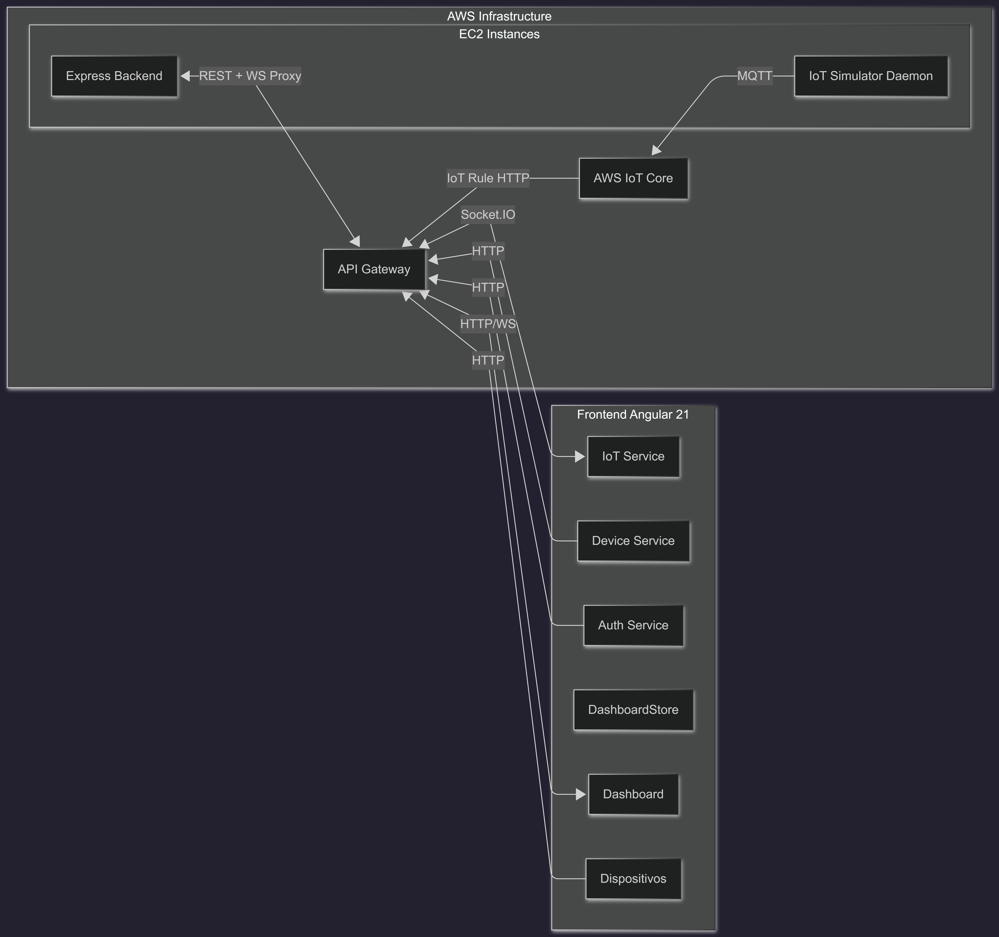

# GSDC IoT Monitor

Plataforma de monitoreo en tiempo real para dispositivos IoT en centro de datos.

## Video Demo

[](https://youtu.be/znXDLYthFg4)

## Demo en Vivo

| Servicio | URL |
|----------|-----|
| **Frontend (HTTPS)** | https://d574amddekt52.cloudfront.net |
| **Frontend (S3)** | http://iot-monitor-frontend-137583030560.s3-website-us-east-1.amazonaws.com |
| **Swagger** | http://100.51.1.187:3000/api-docs |
| **API Gateway REST** | https://k1s7q1ooe1.execute-api.us-east-1.amazonaws.com/v1 |
| **WebSocket** | wss://36bjkrvspj.execute-api.us-east-1.amazonaws.com/v1 |

**Credenciales:** `admin@iot.local` / `Admin123!`

## Arquitectura AWS

```
┌──────────────────┐    MQTT/TLS     ┌──────────┐    IoT Rule     ┌──────────────┐
│ EC2 IoT Gateway  │───────────────▶│ IoT Core │───────────────▶│   Lambda     │
│ (Simulador)      │  (X.509 certs) │          │                │ (Node.js 20) │
└──────────────────┘                └──────────┘                └──────┬───────┘
                                                                       │
                            ┌──────────────────────────────────────────┼───────┐
                            │            ┌────────────────┐           │       │
                            │    HTTP    │ API Gateway    │◀─── HTTP          │
                            │◀───────────│ (REST + WS)   │                   │
                            │            └────────────────┘                   │
                            ▼                                                 ▼
                   ┌────────────────┐                              ┌──────────────┐
                   │ CloudFront CDN │                              │  DynamoDB    │
                   │ (S3 origin)    │                              │ (GSIs + TTL) │
                   └────────────────┘                              └──────────────┘
```

| Servicio AWS | Recurso |
|-------------|---------|
| DynamoDB | `IoT_Monitor_Table` (single-table, 2 GSIs, TTL) |
| EC2 Backend | `gsdc-iot-monitor-backend` (t3.micro, systemd) |
| EC2 Gateway | `gsdc-iot-monitor-gateway` (simulador como demonio) |
| API Gateway REST | `gsdc-iot-monitor-api` (HTTP proxy → EC2) |
| API Gateway WS | `gsdc-iot-ws` (WebSocket proxy → EC2 Socket.IO) |
| S3 | `iot-monitor-frontend-*` (website hosting) |
| CloudFront | `d574amddekt52.cloudfront.net` (CDN global) |
| IoT Core | Thing + Cert X.509 + Policy + Topic Rule |
| Lambda | `gsdc-iot-ingest` (recibe IoT Core → persiste en DynamoDB) |
| IAM | Roles EC2 + Lambda con permisos DynamoDB |

## Repositorios

| Componente | README                                         |
|-----------|------------------------------------------------|
| Backend   | [Backend/README.md](./Backend/README.md)       |
| Frontend  | [Frontend/README.md](./Frontend/README.md)     |

## Stack

| Capa     | Tecnología                           |
|----------|--------------------------------------|
| Backend  | Node.js 20, Express 5, DynamoDB      |
| Frontend | Angular 21, PrimeNG 21, Socket.IO    |
| WS       | Socket.IO 4                          |
| BD       | DynamoDB (single-table, 2 GSIs)      |
| Cache    | node-cache (TTL 10s)                 |

## Inicio Rápido

```bash
# 1. DynamoDB local
cd Backend && docker compose up dynamodb-local -d

# 2. Backend
npm install && npm run db:init && npm run dev

# 3. Frontend (otra terminal)
cd Frontend && npm install && npm start

# 4. Simulador (otra terminal)
cd Backend && npm run simulator
```

- Frontend: http://localhost:4200
- API + Swagger: http://localhost:3000/api-docs

## Arquitectura

### Backend



### Frontend



## Documentación

- [Especificación técnica](./PRUEBA_TECNICA.md)
- [Auditoría de cumplimiento](./AUDITORIA.md)
- [Plan de commits](./COMMITS.md)
- [Colección Postman](./IoT%20Monitor%20API.postman_collection.json)
